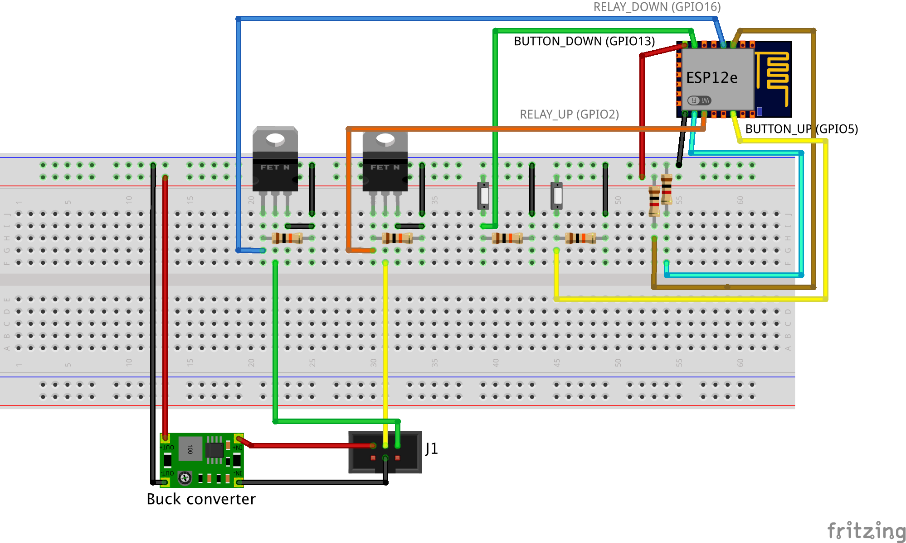
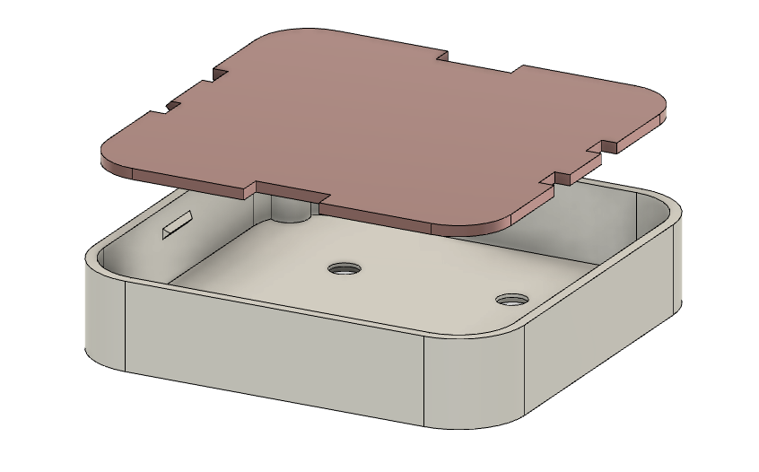
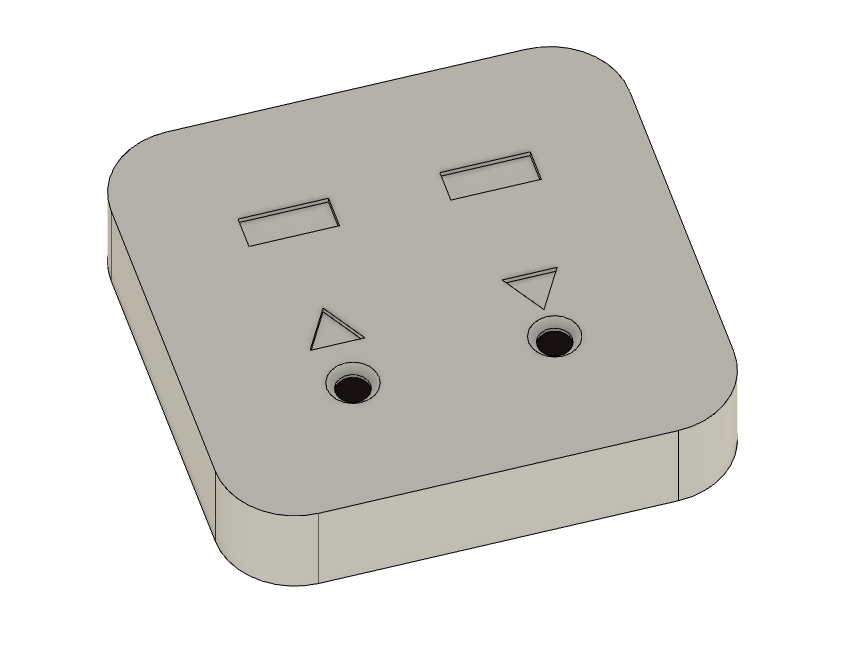

# esp8266_merten58xx

## Description
This is ESP8266 based IoT device replacing Merten 5801 (or similar) window rolladen controller.
The functionality includes control of rolladen position with MOSFET switches using manual
buttons or over MQTT. MQTT can be used for HomeAssistant integration and automation.
Optionally, device status can be indicated via an LED.

## Setup

### Software
1. Clone project to local folder.
1. Install dependencies in PlatformIO.
1. Prepare system configuration in `config.h`.
1. Enter WiFi credentials and MQTT server connection details in `connection_credentials.h`
1. Compile project and flash ESP8266 board.

### Hardware
Here is an example of how to connect bare ESP8266 board. If you use a development board,
you will have to the configuration accordingly. 

Connect ESP8266 and other parts of circuit according to the scheme below.

## Housing
Housing can be 3D printed with generic PLA filament. Original CAD-model and STL-files can be found in `cad` folder.
It consitst of  main housing body (white) and separator lid (red). The lid snaps into the housing and have opennings for wiring.

Top part of the housing features holes for pushbuttons and indicators for motion directions. After wiring the controller to relays, 
the housing can be snapped into the relay fitting on the wall.

